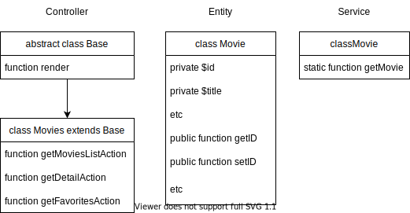

# Диаграмма классов

## Текстовое описание работы проекта
Наш проект организует работу сайта BITFLIX. Клиент заходит на страницу index.php и запускает процесс с роутингом
и отправляется на стартувую страниццу нашего сайта. Для отображения контента на странице обращаемся к контроллеру
Movies, которые наследуется от Base. Вызывается метот render (***для отрисовки шаблонов***) и идет обращение к сервижу, где создается новая сущность.
Эта сущность Movie обращается к бд и берет из нее данные.